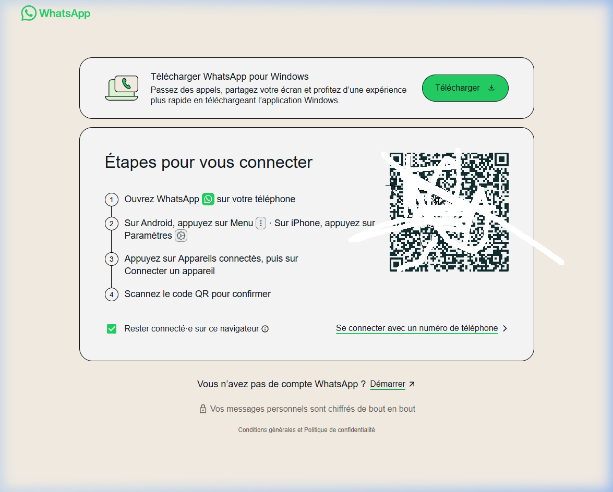
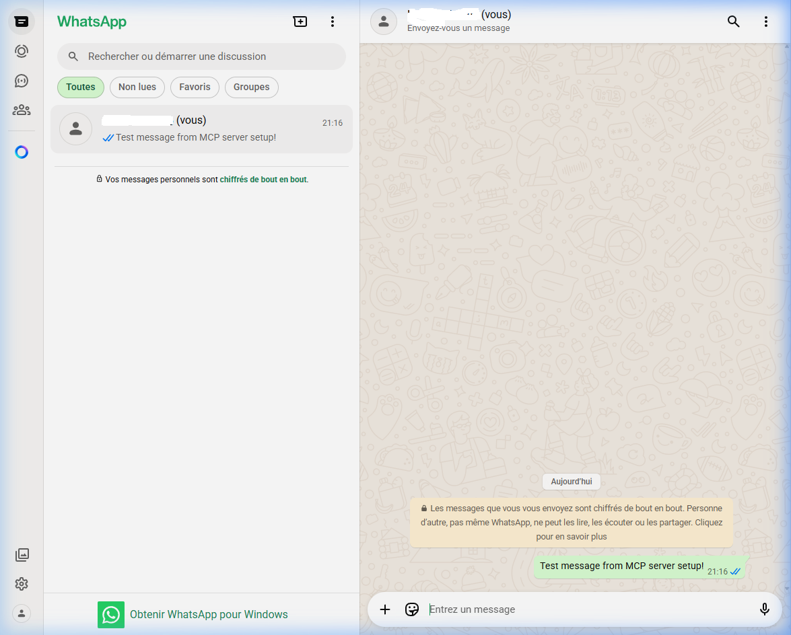

# 🟢 WhatsApp MCP Server


Un serveur MCP (Model Context Protocol) pour contrôler WhatsApp Web via **Puppeteer Stealth**, permettant à ton IA (Claude/Antigravity) de lire et envoyer des messages comme un humain.

---

## 📐 Architecture

```
whatsapp-server/
├── src/
│   ├── index.ts                      ← Entrée FastMCP, enregistre les outils
│   ├── services/
│   │   └── whatsappService.ts        ← Singleton : gère browser/page/delays
│   └── tools/
│       ├── connectWhatsappTool.ts    ← Outil : se connecter à WhatsApp Web
│       ├── listChatsTool.ts          ← Outil : lister les discussions
│       ├── sendMessageTool.ts        ← Outil : envoyer un message
│       └── readMessageTool.ts        ← Outil : lire les messages
├── assets/                           ← Screenshots README
├── .gitignore                        ← Protège session, .env, configs perso
├── eslint.config.js
├── tsconfig.json
└── package.json
```

**Flow :**

```
AI (Claude/Antigravity)
        │ tool calls (MCP stdio)
        ▼
whatsapp-mcp-server (FastMCP)
  ├── ConnectWhatsappTool
  ├── ListChatsTool
  ├── SendMessageTool
  └── ReadMessageTool
        │ shared singleton
        ▼
  WhatsappService
        │ puppeteer-extra + stealth plugin
        ▼
  Chrome (headless ou visible)
        │
        ▼
  https://web.whatsapp.com/
```

---

## ⚙️ Installation

### 1. Copier le dossier

```bash
cd "whatsapp-server"
```

### 2. Installer les dépendances

```bash
pnpm install
```

### 3. Compiler

```bash
pnpm run build
```

### 4. Ajouter dans `mcp_config.json`

```json
"whatsapp-server": {
  "command": "node",
  "args": [
    "/chemin/vers/whatsapp-server/dist/index.js"
  ],
  "disabled": false
}
```

---

## 🚀 Utilisation

### Étape 1 — Connexion (première fois)

Demande à l'IA :

> _"Connecte-toi à WhatsApp en mode non headless"_

L'outil `connect_whatsapp` ouvre Chrome et affiche le QR code :



**Sur ton téléphone :**

1. Ouvre **WhatsApp**
2. **Menu > Appareils connectés** (Android) ou **Paramètres > Appareils connectés** (iPhone)
3. **Connecter un appareil**
4. **Scanne le QR code**

✅ La session est sauvegardée dans `./whatsapp_session/` — pas besoin de rescanner.

---

### Étape 2 — Lister les discussions

Demande à l'IA :

> _"Liste mes conversations WhatsApp"_


---

### Étape 3 — Envoyer un message

Demande à l'IA :

> _"Envoie 'Bonjour !' à [Nom du contact] sur WhatsApp"_



---

### Étape 4 — Lire les messages

Demande à l'IA :

> _"Lis les derniers messages de [Nom du contact] sur WhatsApp"_

L'outil `read_messages` extrait l'historique récent avec l'expéditeur et l'horodatage.

---

## 🛡️ Anti-Ban — Comportement Humain

| Protection              | Détail                                                        |
| ----------------------- | ------------------------------------------------------------- |
| **Puppeteer Stealth**   | Masque les empreintes Puppeteer (`navigator.webdriver`, etc.) |
| **Délais aléatoires**   | 300ms–5000ms entre chaque action                              |
| **Frappe humaine**      | 100–300ms par touche pour la recherche                        |
| **Session persistante** | `whatsapp_session/` évite les reconnexions fréquentes         |
| **User Agent réaliste** | Chrome 120 / Windows 10 64-bit                                |
| **Auto-dismiss dialog** | Clique automatiquement sur "Utiliser ici" si détecté          |
| **Reconnexion propre**  | Ferme l'ancien browser avant d'en ouvrir un nouveau           |

---

## 🔧 Outils MCP disponibles

### `connect_whatsapp`

Lance le navigateur et ouvre WhatsApp Web.

| Paramètre  | Type    | Défaut  | Description                                             |
| ---------- | ------- | ------- | ------------------------------------------------------- |
| `headless` | boolean | `false` | Mode invisible. Mettre `false` pour scanner le QR code. |

### `list_chats`

Liste les discussions récentes.

| Paramètre | Type   | Défaut | Description                      |
| --------- | ------ | ------ | -------------------------------- |
| `limit`   | number | `10`   | Nombre max de chats à retourner. |

### `send_message`

Envoie un message à un contact ou groupe.

| Paramètre  | Type   | Requis | Description                     |
| ---------- | ------ | ------ | ------------------------------- |
| `chatName` | string | ✅     | Nom exact du contact ou groupe. |
| `message`  | string | ✅     | Contenu du message à envoyer.   |

### `read_messages`

Lit les messages récents d'une discussion spécifique.

| Paramètre  | Type   | Requis | Description                                    |
| ---------- | ------ | ------ | ---------------------------------------------- |
| `chatName` | string | ✅     | Nom exact du contact ou groupe.                |
| `limit`    | number | 10     | Nombre de messages à récupérer (max visibles). |

---

## 📋 Commandes

```bash
pnpm install      # Installer les dépendances
pnpm run build    # Compiler TypeScript → dist/
pnpm run dev      # Lancer en mode développement (tsx)
pnpm run lint     # Vérifier le code avec ESLint
pnpm run format   # Formater avec Prettier
```

---

## ⚠️ Recommandations

- **Ne pas spammer** : laisser des délais naturels entre les usages.
- **Session warmup** : après le premier QR scan, ouvre 2-3 discussions manuellement avant de fermer Chrome.
- **Headless=false** pour le premier scan. Ensuite `true` est possible pour les relances.
- **1 compte = 1 session** : ne pas utiliser le même numéro sur plusieurs instances simultanées.

---

## 🔒 Sécurité — Ce qui est protégé par `.gitignore`

| Dossier/Fichier     | Raison                                               |
| ------------------- | ---------------------------------------------------- |
| `whatsapp_session/` | Cookies et tokens de session WhatsApp                |
| `.env`              | Variables sensibles (clés API, numéros de téléphone) |
| `mcp_config.json`   | Chemins locaux et configs privées                    |
| `dist/`             | Build généré — reconstruit avec `pnpm build`         |
| `node_modules/`     | Dépendances — reconstruit avec `pnpm install`        |

---

_Développé par Deamon — Architecture calquée sur le serveur SMS/VoIP.ms MCP_
